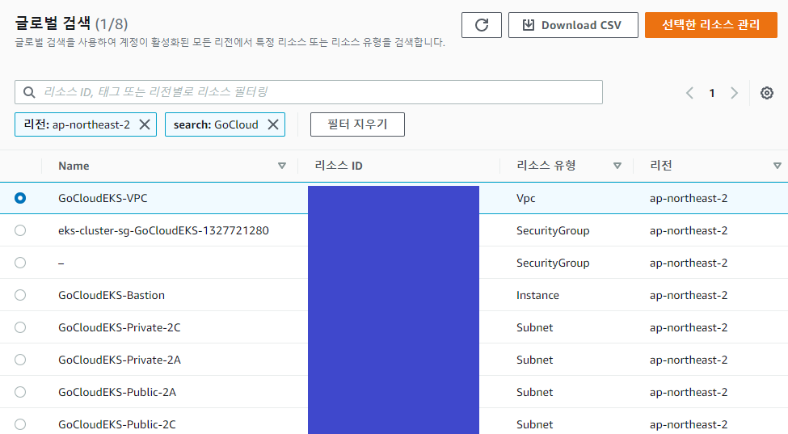
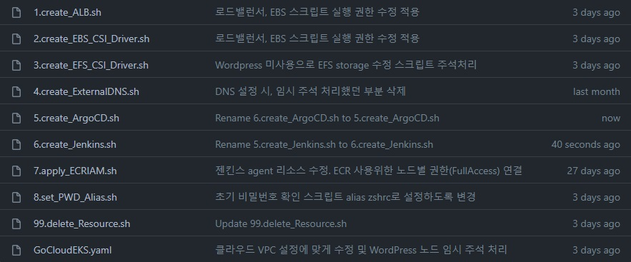
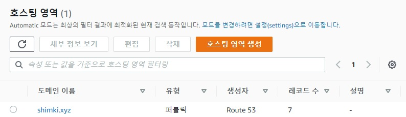

[TOC]

# AWS Cluster First Setting (2021.11.30)

Using Shell, Eksctl, Aws Authenticator, Kubernetes, Docker, WordPress, Mysql, Nginx


# AWS Cluster Second Setting (2021.12.20)

Using Shell, Eksctl, Aws Authenticator, Kubernetes, Docker, Spring, JPA, Mysql, Slack


---


## 1. 네트워크 설정



### 	1) 네트워크 구성 요소에 대해 좀더 알아가고자 VPC, Subnet, IGW, Route Table, NAT 를 수동으로 구성

* 가용영역 2개 사용하는 형태로 구성 (2A, 2C)

[./Network/AWS_VPC_Setting.md]: Network/AWS_VPC_Setting.md	"세부구성 참고"


---


## 2. EKS 클러스터 생성 및 AWS 환경 설정 스크립트



### *  EKS 클러스터 생성 - GoCloudEKS.yaml

```bash
# VPC를 지정해 생성하고 있으므로, 각자 생성한 VPC와 Subnet ID로 수정 후 실행.
eksctl create cluster -f GoCloudEKS.yaml
```

### 1) ALB - Application Load Balancer 설정 (1.create_ALB.sh)

### 2) EBS - Elastic Block Store 설정 (2.create_EBS_CSI_Driver.sh)

### 3) EFS - Elastic File System 설정 (3.create_EFS_CSI_Driver.sh)

### 4) DNS - External-DNS  설정 (4.create_ExternalDNS.sh)

#### * 사전준비물 - 도메인 서비스 (가비아를 사용함.)

* DNS의 경우 AWS의 Route53 서비스의 호스팅 영역 생성 후, ACM 인증서 생성 후 사용.



### 5) ArgoCD 설치 (5.create_ArgoCD.sh)

* 도메인을 사용하지 않을 경우, 5.create_ArgoCD.sh 수정 필요

### 6) Jenkins 설치 (6.create_Jenkins.sh)

* 도메인을 사용하지 않을 경우, 6.create_Jenkins.sh 수정 필요

### 7) Amazon ECR 레지스트리 사용하기 위한 설정 (인증처리 및 노드별 권한 설정)

### 8) 설치한 ArgoCD와 Jenkins의 초기 비밀번호 호출용 Alias 설정 스크립트
